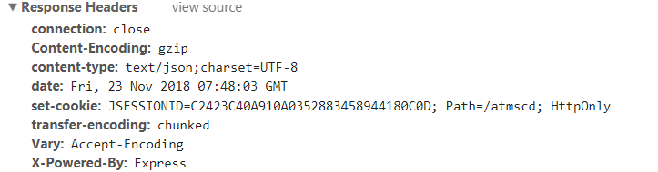
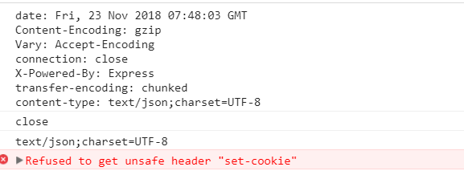
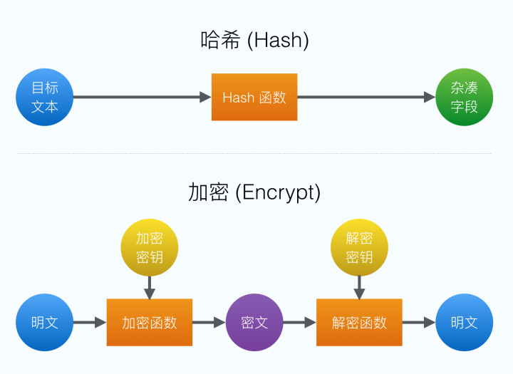
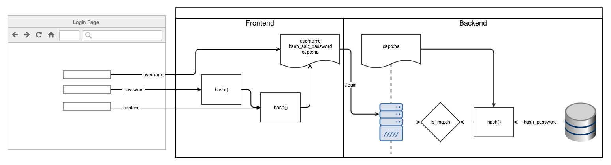

## 文件上传加密

前置知识：XMLHttpRequest、ajax、加密方式

### XMLHttpRequest 与 ajax

ajax 是一种技术方案，其中核心的依赖是浏览器提供的 XMLHttpRequest 对象，浏览器通过该对象可以发出 HTTP 请求与响应。

一句话总结：通过使用 XMLHttpRequest 对象发送一个 ajax 请求

#### XMLHttpRequest 具体使用

简单来说创建一个 HTTP 请求的五个步骤：

- 1.创建 XMLHTTPRequest 对象

- 2.使用 open 方法设置请求方式

- 3.发送请求

- 4.注册事件

- 5.根据返回值进行操作

下面是一个使用 xhr 创建 HTTP 请求，发送表单数据的过程：

```
function sendAjax() {
  let formData;
  let xhr;

  // 构造表单数据对象，并往其添加数据
  formData = new FormData();
  formData.append('username', 'formData');
  formData.append('password', 123456);

  // 1、创建xhr对象
  if (window.XMLHttpRequest) {
    xhr = new XMLHttpRequest();
  } else {
    // ie6及其以下版本，基本可以不写
    xhr = new ActiveXObject('Microsoft.XMLHTTP');
  }

  // 2、创建一个 post 请求，设置请求的url参数
  // 三个参数：请求方式、请求地址(get方式时，传输数据是加在地址后的)、是否异步请求(同步请求的情况极少)；
  xhr.open('POST', '/server', true);

  // post请求一定要添加请求头不然会报错 (open之后，send之前)
  xhr.setRequestHeader('Content-Type', 'application/form-data; charset=UTF-8');

  // 3、发送数据
  xhr.send(formData);

  // 4、注册事件，只要 readyState 的值变化就会调用onreadystatechange事件
  xhr.onreadystatechange = function() {

    // readyState属性表示请求/响应过程的当前活动阶段，4为完成，已经接收到全部响应数据
    /*
      0 － （未初始化）：创建xhr对象，open()方法还未被调用
      1 － （已打开，未发送）：调用open()。此时才能调用xhr.setRequestHeader()和xhr.send()
      2 － （已获取响应头）：调用send()，返回响应头和响应状态
      3 － （正在下载响应体）：下载响应体
      4 － （完成）：整个数据传输过程结束
    */

    if(xhr.readyState === 4) {
      if(xhr.status == 200||xhr.status == 304){
        // 5、根据返回值进行操作
        alert(xhr.responseText);
      }
    };
  };
}
```

#### 获取 response header

xhr 提供了 2 个用来获取响应头部的方法：getAllResponseHeaders 和 getResponseHeader(String)

前者是获取 response 中的所有 header 字段，后者只是获取某个指定 header 字段的值

但不包含 Set-Cookie，会报 Refused to get unsafe header "set-cookie" 错误

```
  console.log(xhr.getAllResponseHeaders())
  console.log(xhr.getResponseHeader('Content-type'))
  console.log(xhr.getResponseHeader('set-cookie'))
```

用途：当 Session 过期页面跳转到登录页面。在 Session 过期后，通过 Refresh 值，可以在拦截器（axios）中访问指定的页面路径。





#### 指定 response 的数据类型

希望服务器返回的数据是想要的数据类型，比如：响应返回的数据是字符串，但我们期望最终通过 xhr.response 拿到的直接就是一个 json 对象

```
var xhr = new XMLHttpRequest();
xhr.open('GET', '/path/getInfo', true);
xhr.responseType = 'json';

xhr.onload = function(e) {
  if (xhr.status == 200) {
    var res = xhr.responseText;
    ...
  }
};

xhr.send();
```
下表是responseType可以设置的格式

| 值            | xhr.response     | 数据类型                         | 说明                             |
| ------------- | ---------------- | -------------------------------- | -------------------------------- |
| ""            | String           | 字符串                           | 默认值(在不设置 responseType 时) |
| "text"        | String           | 字符串                           |
| "document"    | Document 对象    | 希望返回 XML 格式数据时使用      |
| "json"        | javascript 对象  | 存在兼容性问题，IE10/IE11 不支持 |
| "blob"        | Blob 对象        |
| "arrayBuffer" | ArrayBuffer 对象 |

#### 获取 response 数据

xhr提供了3个属性来获取请求返回的数据，分别是：**xhr.response**、**xhr.responseText**、**xhr.responseXML**

下表是三者的对比

| 值               | 默认值 | 取值                                                                                             |
| ---------------- | ------ | ------------------------------------------------------------------------------------------------ |
| xhr.response     | ""     | 当responseType为String时，值为""；其他类型时，值为 null                                          |
| xhr.responseText | ""     | 当responseType为String时，xhr对象上才有此属性，此时才能调用xhr.responseText，否则抛错            |
| xhr.responseXML  | null   | 当responseType为String、"document"时，xhr对象上才有此属性，此时才能调用xhr.responseXML，否则抛错 |

#### 设置请求的超时时间

如果请求过了很久还没有成功，我们一般会主动终止请求。XMLHttpRequest提供了timeout属性来允许设置请求的超时时间

一般来说：从 **请求开始** 算起，若超过 timeout 时间请求还没有结束（包括成功/失败），则会触发ontimeout事件，主动结束该请求

【那么到底什么时候才算是请求开始 ？】
——xhr.onloadstart 事件触发的时候，也就是调用 xhr.send() 方法，也就是 readyState=3 的时候。
因为 xhr.open() 只是创建了一个连接，但并没有真正开始数据的传输，而xhr.send()才是真正开始了数据的传输过程。
只有调用了 xhr.send()，才会触发 xhr.onloadstart

#### xhr.withCredentials 与 CORS

> 在发同域请求时，浏览器会将cookie自动加在request header中。但在发送跨域请求时，cookie则没有。

在CORS标准中：浏览器在发送跨域请求时，不能发送任何认证信息（credentials）如"cookies"和"HTTP authentication schemes"。除非xhr.withCredentials为true

在跨域请求中，client端必须手动设置xhr.withCredentials=true，浏览器才会发送认证信息；server端需要设置Access-Control-Allow-Credentials:true，允许浏览器将Cookie包含在请求中，一起发给服务器

需要注意的是，如果要发送Cookie时，Access-Control-Allow-Origin就不能设为星号（接受任意域名的请求），必须指定明确的、与请求网页一致的域名

#### xhr 相关事件

XMLHttpRequestEventTarget接口定义了7个事件：

* onloadstart
* onprogress
* onabort
* ontimeout
* onerror
* onload
* onloadend

XMLHttpRequest 和 XMLHttpRequestUpload 都继承了同一个 XMLHttpRequestEventTarget 接口，所以 xhr 和 xhr.upload 都有列举的7个事件。而 onreadystatechange 是 XMLHttpRequest 独有的事件

总结一下：xhr一共有8个相关事件：7个XMLHttpRequestEventTarget事件+1个独有的onreadystatechange事件；而xhr.upload只有7个XMLHttpRequestEventTarget事件。

下表是 xhr 事件触发条件表：

| 事件               | 触发条件                                                                              |
| ------------------ | ------------------------------------------------------------------------------------- |
| onreadystatechange | xhr.readyState改变                                                                    |
| onloadstart        | xhr.send()方法后                                                                      |
| onprogress         | 上传阶段时xhr.send()之后，xhr.readystate=2 之前触发；下载阶段时 xhr.readystate=3 触发 |
| onload             | xhr.readystate=4，请求完成后。此时注册回调函数                                        |
| onloadend          | 请求结束后                                                                            |
| onabort            | 调用xhr.abort()后                                                                     |
| ontimeout          | onloadstart开始算起，也就是send()方法后                                               |
| onerror            | 若发生Network error则会触发                                                           |

当请求一切正常时，上传下载的相关的事件触发顺序如下：

* xhr.onreadystatechange(之后每次readyState变化时，都会触发一次)
* xhr.onloadstart
  //上传阶段开始：
* xhr.upload.onloadstart
* xhr.upload.onprogress
* xhr.upload.onload
* xhr.upload.onloadend
  //上传结束，下载阶段开始：
* xhr.onprogress
* xhr.onload
* xhr.onloadend

搬文：
[你真的会使用XMLHttpRequest吗？](https://segmentfault.com/a/1190000004322487#articleHeader10)

### 前端数据加密

前端传输的数据一般有几种加密做法: 

* js加密后传输
* 浏览器插件加密传输
* HTTPS 传输

js加密一般分为两种手段: 

一、是使用数据摘要进行数据杂凑 ( 哈希加密 )

二、使用非对称加密算法对明文进行加密 ( 密钥加密 )

严格来讲, 第一种方式并非加密而是一种信息摘要的过程.

#### 哈希加密与密钥加密



可见哈希与密钥是两个不同的东西, 其不同点在于:

* 哈希算法: 用于数据摘要, 通过 hash 函数生成相同长度的文本, 其加密文本长度与明文文本有关. **哈希加密是不可逆的**

* 密钥加密: 分为对称加密与非对称加密

  **非对称加密算法**, 加密和解密的密钥是不同的, 分为私钥和公钥. 常用的 RSA 就是一种非对称加密算法. 
  
  **对称加密算法**, 加密和解密公用同一个密钥, 如 AES/DES. 
  
  从性能上来说, 非对称加密相对于对称加密要慢很多. 在HTTPS中, 认证过程使用了非对称加密, 非认证过程使用了对称加密.

#### 前端加密的意义

在HTTP协议下, 数据是**明文传输**, 在传输过程中可以通过网络直接获取信息, 具有安全隐患; 另一方面在非加密的传输过程中，攻击者可更改数据或插入恶意的代码等。

HTTPS 的诞生就是为了解决中间人攻击的问题. 但如果仍然使用 HTTP 协议, 前端加密的作用即**在数据发送前将数据进行哈希或使用公钥加密。如果数据被中间人获取，拿到的则不再是明文**.

#### 如何加密

1、**哈希加密**

首先回顾下后端通过哈希算法如何验证用户: 如果前端传过来的是明文, 那么在用户在注册时, 将哈希算法也存入数据库. 待用户登录后,将密码进行哈希后和数据库对应的数据比对, 若一致则说明密码正确  ( **密码+哈希** )

为了避免攻击者窃取前后端加密生成的字典，我们需要加盐，并不定期更新盐值：

前端加密后使用定期刷新的 Salt 再一次哈希生成密文，将该密文发送到后端, 数据库中的密码哈希值再与 Salt 哈希，两者进行密文比对. ( **密码+Salt+哈希** )

由于攻击者仍可以使用加密后的密码进行直接登陆，所以固定的 Salt 并不安全. 动态 Salt 有很多方法，可以是动态的 Token，也可以直接使用现成的验证码, 或者图形验证码

##### 动态Salt加密过程: 
前端先将密码哈希, 然后和用户输入的验证码进行哈希, 得到的结果作为密码字段发送给服务器. 服务器先确认验证码正确，然后再进行密码验证，否则直接返回验证码错误信息



先来理解两个概念: 

> **撞库**: 由于用户在不同网站使用的是相同的帐号密码, 收集已泄露的用户和密码信息，生成对应的字典表，尝试批量登陆其他网站后，得到一系列可以登录的账号
> 
> **拖库**: 指网站遭到入侵后，黑客窃取其数据库

js哈希加密保证了密码在传输过程中的资料安全, 因为验证码是动态的, 即使攻击者拿到了数据也无法重放. 图形化验证码更是增加了难度. 另一方面该实践大大增加了撞库的成本

使用一些前端加密手段，可以加大拖库后的数据破解的难度. 但是之前介绍的验证码方法不具有这样的功能，因为数据库存的仍是**哈希后的明文密码**后的结果，那么攻击者可以直接窃取数据库进行**暴力破解**

从两个方面分别去思考如何进一步提升性能 

* 降低暴力破解速度

  **暴力破解即是使用相同的算法把常用的字符组跑一遍**

  >数据被暴力破解出来的时间与哈希算法速度负相关. 也就是说, 哈希算法越快, 破解的时间越快. 

  例如 MD5 加密一次耗费1微秒，那么攻击者一秒钟就可以猜大约 100万 个词组. 所以为了减慢破解速度，我们需要增加破解的时间，一个直接的方法就是使用更慢的算法，我们可以把常用的MD5算法替换为 bcrypt，PBKDF2 等慢算法

* 前端加密结果影响数据库的数据存储

  由于慢的算法会增加服务器计算压力，可以把一部分哈希工作分到前端，即减慢了加密速度，减轻了服务器压力，也顺带完成了前端加密的工作
 
哈希加密速度**减慢一定程度会降低用户体验**，这也是一部分站点未启用 https 的原因之一。但是因为我们的前端加密只会用在不常使用的登录和注册上，所以不会影响网站整体的体验


2、**非对称加密**

因为可以在前端窃取数据，一旦密钥失窃就相当于明文数据了, 所以使用对称加密是不安全的. 

非对称加密原理很简单，前后端共用一套加密解密算法，前端使用公钥对数据加密，后端使用私钥将数据解密为明文。中间攻击人拿到密文，如果没有私钥的话是没办法破解的。

这里介绍 jsencrypt 插件实现前端参数加密,jsencypt具体的使用参考 [jsencrypt](https://github.com/travist/jsencrypt)

思路: 拿到公钥和私钥.  利用公钥RSA加密, 私钥解密

```
1 创建密钥对JKS格式keystore：
keytool -genkey -v -alias test -keyalg RSA -keystore test.jks

2 将JKS格式keystore转换成PKCS12证书文件：
keytool -importkeystore -srckeystore test.jks -destkeystore test.p12 -srcstoretype JKS -deststoretype PKCS12

3 使用OpenSSL工具从PKCS12证书文件导出密钥对：
openssl pkcs12 -in test.p12 -nocerts -nodes -out test.key

4 从密钥对中提取出公钥：
openssl rsa -in test.key -pubout -out test_public.pem

```

拿到公钥test_public.pem后，在cat test_public.pem查看这个公钥内容，内容是base64格式的

```
  const jse  = new JSEncrypt() // 创建该对象

  jsencrypt.setPublicKey(this.publicKey)  // 设置公钥

  let enPassword = jse.encrypt(this.password) // 对密码加密
```

**总结**: 在没有 https 的情况下，使用 JavaScript 非对称加密或者插件加密是比较好的替代方法

### 代码实现

上传组件的代码如下，其中根据API可知，http-request属性可以覆盖默认的上传行为，自定义上传逻辑

```
<el-upload :action="file.action" ref="upload" :data="file.data" :before-upload="importReadyUploadFileName" :on-success="importReadyUploadSuccess" :on-error="importReadyUploadFail" :show-file-list="false" :http-request="httpRequest" :disabled="file.disabled">
   <span style="color: #666; width: 56px;display: inline-block;font-weight:bold;">选择</span>
</el-upload>

httpRequest (option) {
  // options 该Vue组件，属性自有; this.publicKey 后端传递的公钥
  uploadCrypt(option, this.publicKey)
}
```

uploadCrypt就是要替换的上传函数，这个地方涉及到**对称加密**和**非对称加密**两种加密方式，再来复习一下：

* 非对称加密采用公钥加密与私钥解密，常用的 RSA 就是一种非对称加密算法。一般用于密码传输
* 对称加密采用统一的密钥加密解密，常用的算法 AES/DES

对于对称加密而言，一旦密钥失窃就相当于明文数据，所以用户密码、私密信息等使用对称加密是不安全的。但当加密文件过大时会导致加密和解密的时间过长。所以当数据较小的时候，采用非对称加密方式更安全；当数据过大时，例如上传文件，对文件本身采用对称加密，而对其密钥采用非对称加密保证安全性

函数中采用了对称加密插件[crypto-js](https://github.com/brix/crypto-js)和非对称加密插件[jsencrypt](https://github.com/travist/jsencrypt)进行加密解密。

```
function uploadCrypt (option, key) {
  if (typeof XMLHttpRequest === 'undefined') {
    return
  }

  /* xhr对象 */
  const xhr = new XMLHttpRequest()
  // option为upload组件，包含action、file、onSuccess等数据
  const action = option.action

  if (xhr.upload) { 
    // 上传进度
    xhr.upload.onprogress = function progress (e) {
      if (e.total > 0) {
        e.percent = e.loaded / e.total * 100
      }
      option.onProgress(e)
    }
  } 

  // 错误处理
  xhr.onerror = function error (e) {
    // 调用组件中的on-error
    option.onError(e)
  }

  // 请求完成，注册 xhr 回调事件
  xhr.onload = function onload () {
    if (xhr.status < 200 || xhr.status >= 300) {
      return option.onError(getError(action, option, xhr))
    }

    // 调用组件中的on-success
    option.onSuccess(getBody(xhr))
  }

  /* formData对象 */
  const formData = new FormData()

  // 将上传时附带的额外参数追加到formData对象中
  if (option.data) {
    Object.keys(option.data).map(key => {
      formData.append(key, option.data[key])
    })
  }

  /* 文件对象 */
  var reader = new FileReader()

  // 开始读取文件内容(readAsDataURL会将文件内容进行base64编码后输出)
  reader.readAsDataURL(option.file)

  // 读取内容完毕后
  reader.onload = function () {
    // 连接后端
    xhr.open('post', action, true)

    // 创建DES密钥，createKey(32)创建随机的32位字符串
    const keyDES = createKey(32)

    // this.result 上传的文件，其格式为"data:application/vnd.ms-excel;base64,..."
    let file = encryptByDES(this.result.split(',')[1], keyDES)

    // 对DES密钥使用RSA加密
    const jse = new JSEncrypt()
    jse.setPublicKey(key)
    let keyRSA = jse.encrypt(keyDES)

    formData.append('file', file)
    formData.append('key', keyRSA)

    // 允许浏览器发送cookies
    if (option.withCredentials && 'withCredentials' in xhr) {
      xhr.withCredentials = true
    }

    // 组件中设置上传的请求头部
    const headers = option.headers || {}
    for (let item in headers) {
      if (headers.hasOwnProperty(item) && headers[item] !== null) {
        // 一般需要设置请求头，设置类型，组件已经默认设置了
        // xhr.setRequestHeader('Content-Type', 'application/form-data; charset=UTF-8');
        xhr.setRequestHeader(item, headers[item])
      }
    }
    xhr.send(formData)
  }
  return xhr
}
```

#### ajax.js详细代码

```
import CryptoJS from 'crypto-js'
import JSEncrypt from 'jsencrypt/bin/jsencrypt'

function getError (action, option, xhr) {
  let msg
  if (xhr.response) {
    msg = `${xhr.status} ${xhr.response.error || xhr.response}`
  } else if (xhr.responseText) {
    msg = `${xhr.status} ${xhr.responseText}`
  } else {
    msg = `fail to post ${action} ${xhr.status}`
  }

  const err = new Error(msg)
  err.status = xhr.status
  err.method = 'post'
  err.url = action
  return err
}

function getBody (xhr) {
  const text = xhr.responseText || xhr.response
  if (!text) {
    return text
  }

  try {
    return JSON.parse(text)
  } catch (e) {
    return text
  }
}

function encryptByDES (message, key) {
  let keyHex = CryptoJS.enc.Utf8.parse(key)
  let encrypted = CryptoJS.DES.encrypt(message, keyHex, {
    mode: CryptoJS.mode.ECB,
    padding: CryptoJS.pad.Pkcs7
  })
  return encrypted.toString()
}

function createKey (num = 32) {
  const lib = [
    'a', 'b', 'c', 'd', 'e', 'f', 'g', 'h', 'i', 'j',
    'k', 'l', 'm', 'n', 'o', 'p', 'q', 'r', 's', 't',
    'u', 'v', 'w', 'x', 'y', 'z', '0', '1', '2', '3',
    '4', '5', '6', '7', '8', '9'
  ]
  let str = ''
  for (let i = 0; i < num; i++) {
    let index = Math.floor(Math.random() * 36)
    str += lib[index]
  }
  return str
}

export default function uploadCrypt (option, key) {
  if (typeof XMLHttpRequest === 'undefined') {
    return
  }

  // 创建xhr对象
  const xhr = new XMLHttpRequest()
  // upload组件中上传的对象，包含file
  const action = option.action

  if (xhr.upload) {
    xhr.upload.onprogress = function progress (e) {
      if (e.total > 0) {
        e.percent = e.loaded / e.total * 100
      }
      option.onProgress(e)
    }
  }

  // 定义formData对象
  const formData = new FormData()

  // 追加文件数据到formData对象中
  if (option.data) {
    Object.keys(option.data).map(key => {
      formData.append(key, option.data[key])
    })
  }

  xhr.onerror = function error (e) {
    option.onError(e)
  }

  xhr.onload = function onload () {
    if (xhr.status < 200 || xhr.status >= 300) {
      return option.onError(getError(action, option, xhr))
    }

    option.onSuccess(getBody(xhr))
  }

  // 定义文件对象
  var reader = new FileReader()

  // 开始读取文件内容(readAsDataURL会将文件内容进行base64编码后输出)
  reader.readAsDataURL(option.file)

  // 读取内容完毕后
  reader.onload = function () {
    // 连接后端
    xhr.open('post', action, true)

    // 创建DES密钥
    const keyDES = createKey(32)
    let file = encryptByDES(this.result.split(',')[1], keyDES)

    // 对DES密钥使用RSA加密
    const jse = new JSEncrypt()
    jse.setPublicKey(key)
    let keyRSA = jse.encrypt(keyDES)

    formData.append('file', file)
    formData.append('key', keyRSA)
    // formData.append('file', this.result.split(',')[1])

    if (option.withCredentials && 'withCredentials' in xhr) {
      xhr.withCredentials = true
    }

    const headers = option.headers || {}

    for (let item in headers) {
      if (headers.hasOwnProperty(item) && headers[item] !== null) {
        // 一般需要设置请求头，设置类型，组件已经默认设置了,open之后，send之前
        // xhr.setRequestHeader('Content-Type', 'application/x-www-form-urlencoded; charset=UTF-8');
        xhr.setRequestHeader(item, headers[item])
      }
    }
    xhr.send(formData)
  }
  return xhr
}
```


