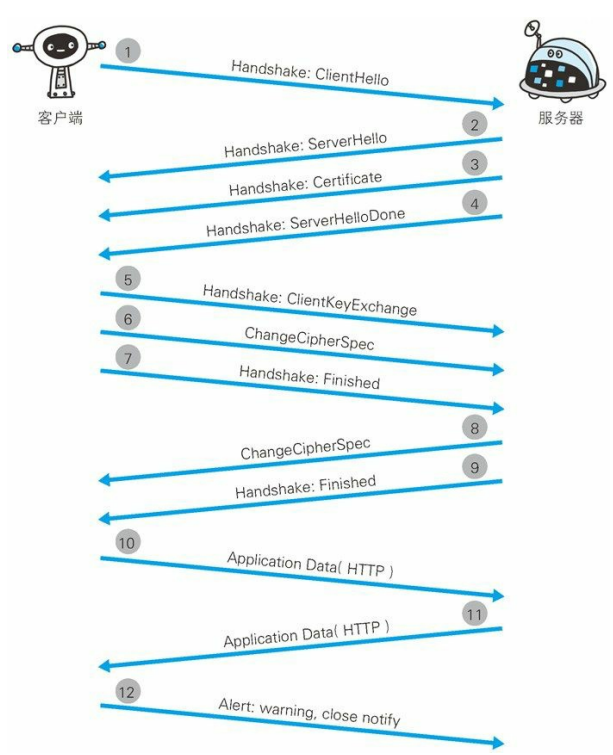

# 《现代前端技术解析》笔记

## Web 前端技术基础

### 现代 Web 前端技术概述

- 借助库和框架 : 解决页面内容多而复杂，保证开发效率

- 组件化思想 : 将复杂的代码结构拆分多个独立解耦的组件，使得项目结构更加侵袭

- 异步加载 : 尽快显示页面内容，解决页面加载内容多的问题

- 图片优化处理（如 webp 格式）: 限制图片大小保证快速展示

- 合理的缓存 : 避免向服务器请求重复的内容

- 移动端、桌面端区别对待 : 移动端使用更加简洁的页面-

### Web 前端技术的发展

1. 静态黄页
2. 服务器组装动态网页数据
3. 后端为主的 MVC
4. 前后端分离
5. 纯前端 MV\*为主、中间层直出
6. 前端 Virtual DOM、MNV\*、前后端同构

### 浏览器处理步骤

1. 接收到用户输入网址后，浏览器开启线程，按照不同的协议（HTTP、HTTPS）进行处理
2. 调用浏览器引擎中对应的方法，分析并加载 URL
3. 通过 DNS 解析获取网站的 IP，查询完成后连同浏览器的 Cookie、userAgent 等信息向目标网站 IP 发出 GET 请求
4. 进行 HTTP 协议会话，浏览器向服务器发送报文
5. 进入网站后台上的 Web 服务器处理请求，如 Apache、Tomcat 等
6. 进入部署好的后端应用，如 PHP、Java 等，找到对应的处理逻辑
7. 服务器处理请求并返回响应报文，如果命中缓存，返回 304，否则返回 200
8. 浏览器下载 HTML 文档或从本地缓存读取文件内容
9. 浏览器根据 HTML 文件解析结构并建立 DOM 文档树，并根据 HTML 中的标记请求下载指定的 MIME 类型文件（CSS、js 脚本等），同时设置缓存等内容
10. 页面开始解析渲染 DOM，CSS 根据规则解析并结合 DOM 文档树进行网页内容布局和绘制渲染，JS 根据 DOM API 操作 DOM，并读取浏览器缓存、执行事件绑定等，整个页面展示过程完成

### 浏览器的组成部分

1. 用户界面 - 浏览器的功能选项
2. 网络 - 通过网络线程下载资源的模块
3. JS 引擎 - 浏览器中各部分之间通信的核心
4. 渲染引擎 - 浏览器内核，解析 DOM、CSS
5. UI 后端 - 绘制窗口内控件
6. JS 解释器 - 执行 JS(V8 引擎)
7. 持久化数据存储 - 客户端存储技术(cookie)

### 渲染引擎的工作流程

/ 1.解析 HTML 构建 DOM 树 /
解析 HTML 构建节点具有父子关系的 DON 树结构

/ 2.构建渲染树 /
根据 DOM 树结构的每个节点顺序提取 CSS 规则，生成渲染树

/ 3.渲染树布局 /
绘制节点的位置 (重排，一定会导致重绘)

/ 4.绘制渲染树 /
绘制节点的样式 (重绘)

### 数据持久化存储技术

/ HTTP 文件缓存（浏览器缓存）/
浏览器根据响应的头信息判断是从本地还是从服务器获取数据。

1、浏览器会查询`cache-control`( 相对过期时间，expires 绝对过期时间，有可能会出现本地和服务器时间不准的情况, 相对时间优先于绝对时间 )来判断内容是否过期。若过期则进入下一步

2、判断返回头中是否包含`Etag` ( 检查文件修改后的版本号 )，若有则连同`If-None-Match`一同向服务器发送请球。服务器判断`Etag`未修改则返回 304，否则进入下一步

3、判断返回头中是否包含`Last-Modified` ( 检查文件修改时间 )，若有则连同`If-Modified-Since`一同向服务器发送请球。服务器判断`Last-Modified`是否与`If-Modified-Since`相等，若相等说明未修改返回 200，否则返回 304

4、若`Etag`和`Last-Modified`都不存在，直接向服务器请求内容

/ localStorage /
HTML5 本地缓存方案，主要用于浏览器保存体积较大的数据。持久化缓存除非手动清除

/ sessionStorage /
功能与 localStorage 类似，但是 sessionStorage 会在浏览器关闭时自动清空

/ Cookie /
辨别用户身份或者 Session 跟踪

不同域名之间的 Cookie 信息是独立的，若需要共享则需要设置 path 和 domai n 实现。HttpOnly 的 Cookie 不能被 document.cookie 获取并修改，只能在服务端进行读写操作，避免了浏览器直接修改增加安全性

/ WebSQL /
用于存储较大容量的缓存机制，集成在浏览器中的小型数据库

/ IndexDB /
存储大量结构化数据并且能使用索引进行高性能检索的 API

/ Application Cache/
通过 manifest 配置文件在本地有选择行的存储 JS、CSS、图片等静态资源的文件级缓存机制(离线浏览、快速加载、服务器负载小)

/ cacheStorage /
在 ServiceWorker 规范中定义，用于保存每个 ServiceWorker 声明的 Cache 对象，未来代替 Application Cache

/ Flash 缓存 /
基于网页端 Flash，具有读写本地目录的功能

### 开发工具与调试工具

- sublime
- webstorm
- vscode
- vim
- Chrome Develop Tool
- Fiddler
- node-inspector
- Vorlon.js(For mobile)
- Weinre(For mobile)

## 前端与协议

### HTTP

HTTP 报文由头部、空行、正文三部分组成，空行用于区分头部和正文，由一个回车符和一个换行符组成

请求头一般包括

- 请求类型
- 请求 URI
- 协议版本
- 扩展内容
- 请求头部域（Accept Cookie Cache-Control Host 等）
- 空行
- 正文内容

响应头一般包括

- 状态码
- 状态描述
- 协议版本
- 扩展内容
- 响应头部域（Date Content-Type Cache-Control Expire 等）
- 空行
- 正文内容

### HTTP1.1 的增强

- 长连接（Connection: keep-alive，连接完成不会立即断开）
- 协议扩展切换
- 缓存控制（Cache-Control）
- 部分内容传输优化

### HTTP2 的增强

- 基于 SPDY2 协议
- 二进制传输（HTTP 1.x 默认基于文本格式）
- TCP 多路复用降低网络请求连接建立和关闭的开销
- 支持传输流的优先级和流量控制机制
- 支持服务器端推送

### Web 安全机制

/ XSS /
跨站脚本攻击：用户输入的内容未经过处理直接插入到页面中进行解析

存储型 XSS：前端提交的数据未处理直接存到数据库中，然后从数据库中读取出来后直接插入到页面

反射型 XSS：网页 URL 参数中注入了可解析的数据，从 URL 中获取数据渲染到页面中

DOM 型 XSS：渲染 DOM 属性时将攻击脚本插入到 DOM 中被解析导致

解决办法：

```javascript
// HTML字符转义，浏览器就不会直接解析了
function htmlEncode(str) {
  let s = "";
  if (str.length === 0) return "";
  s = str.replace(/&/g, "&amp;");
  s = str.replace(/</g, "&lt;");
  s = str.replace(/>/g, "&gt;");
  s = str.replace(/ /g, "&nbsp;");
  s = str.replace(/\'/g, "&#39;");
  s = str.replace(/\"/g, "&quote;");
  s = str.replace(/\n/g, "<br>");
  return s;
}
```

/ CSRF /
跨站请求伪造：非法获取用户登录验证信息后，直接对源站点的接口进行数据请求。若源站点未对该请求验证，该请求可能被执行成功。

解决办法：通过加密计算的 Token 验证。服务器只会给源站点提供加密后的 Token，浏览器提交时将 Token 一起带给服务器验证。

/ SQL 注入 /
提交数据后服务器未对数据验证就直接拼接搭配 SQL 语句中执行

/ 请求劫持（DNS 劫持、HTTP 劫持）/

DNS 劫持：通过篡改 DNS 服务器上的域名解析记录，返回用户一个错误的 DNS 查询结果。导致正确的网址错误的解析到错误的 IP

HTTP 劫持：在网络数据传输通道中从网关或者防火墙层上监视数据，从而插入或者修改数据

### HTTPS 协议通信过程

HTTPS 加入 SSL 层加密 HTTP 数据，启用默认为 443 的端口进行数据传输

简单概述：客户端与服务器都有各自的公钥和私钥，通过公钥加密、私钥解密的方式判断连接是否安全。

1、客户端发起请求，告诉服务器建立 HTTPS 连接
2、服务器生成公钥 S1 返回客户端，若是初次连接还要进行连接验证
3、若需要连接验证，客户端生成特定的验证串并使用 S1 加密，与自己生成的公钥 C1 一同发送给服务器
4、服务器根据自己的私钥解密验证串后，再通过客户端的公钥 C1 加密后返回给客户端
5、客户端通过私钥解密后判断是否为自己起初发送的验证串，若正确则说明连接安全
6、连接创建，客户端通过 S1 不断加密数据然后发送到服务器；服务器也不断解密获取报文，并通过 C1 加密响应报文返回给客户端。



### 浏览器 Web 安全控制

一些特定的 head 头配置

- X-XSS-Protection
- Strict-Transport-Security
- Content-Secutiry-Policy
- Access-Contorl-Allow-Origin

### 前端实时协议

- WebSocket : 双向数据实时通信
- Poll : 浏览器定时向服务器发送请求轮询的方法获取数据
- Long Poll ： 较长的 TimeOut 时间内，服务器一旦响应，请求会立刻返回结果(手机扫描二维码登录网站)
- DDP（Distributed Data Protocol 分布式数据协议）- Node.js 可通过 ddp 模块使用
- SSE 见[这里](http://www.ruanyifeng.com/blog/2017/05/server-sent_events.html)

### Restful 数据协议规范

### 与 Native 交互协议

### Web 到 Native 协议调用

**通过 URI 请求**

Native 应用在系统注册一个 Scheme 协议的 URI，这个 URI 可在系统的任意地方授权访问原生代码。Native 的 WebView 控件中的 JS 脚本请求也可以匹配该通用的 Scheme 协议

```
let iframe = document.createElement('iframe')
iframe.setAttribute('style', 'display: none')
document.body.appendChild(iframe)
iframe.setAttribute('src', 'myApp://className/method?args')
```

**通过 addJavascriptInterface 注入方法到页面中调用**

Java 代码侧

```
WebSettings webSettings = webView.getSettings();
webSettings.setJavaScriptEnabled(true);
webView.loadUrl("file:///android_asset/index.html");
webView.addJavascriptInterface(new JsInterface(), "native"); // webView里有个全局变量叫native

public class JsInterface(){
	@JavascriptInterface
	public void showToast(String toast){
		Toast.makeText(MainActivity.this, toast, Toast.LENGTH_SHORT).show();
	}
}
```

JS 代码侧

```
<script>
	function nativeAlert(msg){
		native.showToast(msg);
	}
</script>
```

#### Native 到 Web 协议调用

通过 Native 的`loadUrl`(Android)或`stringByEvaluatingJavaScriptFromString`(iOS)方法实现

```
WebSettings webSettings = webView.getSettings();
webSettings.setJavaScriptEnabled(true);
webView.loadUrl("file:///android_asset/index.html");
JsInterface jsInterface = new JsInterface();
jsInterface.log('hello');

public class JsInterface{
	public void log(final String msg){
		webView.post(new Runnable() {
			@Override
			public void run(){
				webView.loadUrl("javascript: log(" + "'" + msg + "'" + ")")
			}
		})
	}
}
```

JS 侧有个 log 方法

```
<script>
	function log(msg){
		console.log(msg)
	}
</script>
```

另一种替代方案是使用`setWebChromeClient`方法，它可以重写`onJsAlert`和`onJsPrompt`方法来监听 webView 中的`alert`和`prompt`方法

```
webView.setWebChromeClient(new WebChromeClient(){
	@Override
	public boolean onJsPrompt(WebView view, String url, String message, String defaultValue, JsPromptResult result){
		result.confirm(JSBridge.callJsPrompt(MainActivity.this, view, message));
		return true;
	}
})
```

一个常用的通信规则是`jsbridge://className:callbackMethod/methodName?jsonObj`，`callbackMethod`是为了在 JS 调用 Native 方法成功后异步通过`loadUrl('javascript:callbackMethod()')`来让 JS 继续进行操作，给一个例子`jsbridge://Util:success/toString?{"msg": "hello"}`

一段通用的注册代码

```
JSBridge.call = function(className, methodName, params, callback){
	let bridgeString
	let paramsString = JSON.stringify(params || {})
	if(className && methodName){
		bridgeString = `jsbridge://${className}:${callback}/${methodName}??${paramsString}`
		try{
			sendToNative(bridgeString)
		}catch(e){
			console.log(e)
		}
	} else {
		console.log('invalide className or methodName')
	}
}

funciton sendToNative(uri, data){
	window.prompt(uri, JSON.stringify(data || {}))
}
```

## 前端三层结构与应用

### HTML 结构层基础

- DOCTYPE 的演变
- 标签要语义化
- Google 的 AMP HTML 提议规范
  _ 只允许异步的 script 脚本
  _ 只加载静态的资源
  _ 不能让内容阻塞渲染
  _ 不在关键路径中加载第三方 JS
  _ 所有的 CSS 必须内联
  _ 字体使用声明必须高效
  _ 最小化样式声明
  _ 只运行 GPU 加速的动画
  _ 处理好资源加载顺序问题
  _ 页面必须立即加载 \* 提升 AMP 元素性能

### 前端结构层演进

- XML 与 HTML
  \_XML : **存储数据**的一种特殊文本标记格式
  \_HTML: **展示数据**的文本标记格式
- HTML5 标准
  _ header=
  _ article
  _ datalist
  _ progress
  _ command 定义命令按钮
  _ video 视频播放界面
  _ source 音频、视频
- Web Component 与 Shadow DOM

### 浏览器脚本演进

- CoffeeScript
- ECMAScribe 标准
- TypeScript
- JS 衍生脚本（JSX 等）

### JS 标准实践

#### ES5

- 严格模式
- JSON 对象
- Object 对象增强
- Array 对象增强
- Funtion 方法 bind
- String 方法 trim
- Date 方法 now、toJSON

#### ES6

- let const
- 字符串模板
- 解构
- Array 增强
- 函数参数增强
- 箭头函数
- Object 增强
- class
- module
- Iterator
- Generator
- Map Set WeakMap WeakSet
- Promise
- Symbol
- Proxy
- ...

### 前端表现层基础

- CSS 选择器与优先级
- CSS 属性
  _ 布局类
  _ 几何类
  _ 文本类
  _ 动画类 \* 查询类

### 前端界面技术

CSS 样式统一化：
reset 清除浏览器的默认样式
normalize 使用一种默认样式
neat 结合网站特点，使用前两种

CSS 预处理： SASS LESS Stylus postCSS

动画：

- JS 实现
- SVG
- CSS3 transition
- CSS3 animation
- Canvas
- requestAnimationFrame

### 响应式网站

1. 根据userAgent跳转不同的页面完成设备、浏览器的适配
   > 例如使用浏览器访问移动站点下的Web站点页面，Web站点会根据userAgent判断进行302跳转到对应的桌面Web页面下

   问题：
   1、至少使用两个站点支持不同端的适配
   2、选择哪个站点内容由设备的userAgent判断，而无法根据屏幕尺寸和分辨率
   3、多了一次跳转
   ```javascript
   if (navigator.userAgent.match(/iPhone|iPod|Android|iPad/i)) {
     let hash = window.location.hash,
         params = window.location.search;
     location.href = '//m.domain.com/path/page.html' + params + (hash ? (params ?'&':'?') + hash.substr(1) :'')
   }
   ```
   
2. 使用 JS、media query、<picture>、rem 等手段
   > 根据media query访问一个站点实现不同屏幕下的布局显示，适用访问量小，性能要求不高的场景

   问题：
   1、移动端加载了桌面浏览器一样的资源，导致加载冗余
   2、这种响应式只实现了内容布局显示的适应，但差异性比较差
   3、兼容性问题

  **分析以上两种场景，总结主要的问题有以下几点：**

  _ 能否使用同一个站点域名避免跳转的问题
  _ 能否保证移动端加载的资源内容最优
  _ 如何做到移动端和桌面端的差异化功能
  _ 如何根据更多信息而不是仅仅userAgent进行判断

## 现代前端交互框架

### 直接操作 DOM

- 原生 DOM 方法
- jQuery

### V\*交互模式

#### MVC
  **用户操作DOM是通过Controller控制，调用Model渲染View**

  数据模型(Model)：存放请求的数据结果和数据对象
  视图(View)：页面DOM的更新
  事件控制函数(Controller)：根据前端路由来调用不同Model给View渲染内容
#### MVP
  **用户操作DOM是通过触发View上的行为，然后通知Presenter来完成Model和View的更新**

  数据模型(Model)：存放请求的数据结果和数据对象
  视图(View)：页面DOM的更新
  事件控制函数(Presenter)：根据前端路由来调用不同Model给View渲染内容。**同时与View双向绑定**

#### MVVM 的数据变更检测方法

- 手动触发绑定
- 脏值检测
- 前端数据对象劫持（使用 Object.defineProperty、Object.defineProperties 对 ViewModel 对象进行 get()和 set()的监听）
- ES6 Proxy

#### VirtualDOM

MVVM缺点：处理数据最终反映到页面上View层的渲染和改变仍是通过操作DOM来完成。通常一次ViewModel的变化可能会触发页面上多个指令操作DOM的变化

VirtualDOM：能够直接描述一段DOM结构的JS对象，浏览器可以根据它的结构按照一定规则创建出唯一的DOM结构。减少了对DOM的操作次数，并且在数据发生改变后进行最小化的页面DOM操作

> 将新的Model Data和旧的Model Data进行比较，记录ViewModel改变的方式和位置，而不再直接重新渲染


Model-NativeView-\* 如 React-Native 解决方案，转为原生控件展示

### 前端MNV*时代

## 前端项目与技术实践

### 前端开发规范

**前端通用规范**

- HTML CSS JS 结构分离
- 统一用 tab 缩进
- 用`<meta charset="utf-8">`指定编码
- 一般都用小写
- 代码单行长度限制（120 或 80 字符）
- 注释
- 删除行尾空格与符号

**前端 HTML 规范**

- 用`<!DOCTYPE html>`定义文档类型
- head 内容包含 title、keyword、description 等 SEO 所需要的内容
- 省略 type，如`text/css`、`text/javascript`
- 使用双引号包裹属性值
- 属性值省略，不用指定`true`或`readonly`等
- 元素正确的嵌套，如 inline 元素里不嵌套 block 元素
- 标签合理闭合
- 使用 img 的 alt 属性
- 使用 label 的 for 属性
- 按模块添加注释，如`<!-- News List module -->`
- 元素标签合理的分行、缩进
- 标签语义化

**前端 CSS 规范**

- 引用规范，不推荐 style
- 合理命名，class 用中划线-，样式一般不用 id（没法复用）
- 简写方式，0 不需要单位，URL 资源的引号不需要
- 属性书写顺序，先布局后内容
- Hack 写法，先私有属性后标准属性（-webkit-box-shadow 在 box-shadow 之前）
- 高效实现，不冗余
- 使用预处理脚本

**ES5 规范**

- 分号统一加上
- 合理空格、空行
- 字符串最外层用单引号
- 合理变量命名，jQuery 对象用\$开头
- 对象属性名不加引号，键值缩进，数组、对象属性后不能有逗号
- 代码块大括号不省略
- 条件判断要严谨
- 不在条件语句或循环语句中声明函数

**ES6 规范**

- 正确使用 let const
- 字符串拼接使用字符串模板
- 解构赋值尽量就一层
- 数组拷贝推荐使用...实现
- 数组遍历推荐用 for of
- 尽量使用 class 定义类，使用 constructor 进行属性成员变量赋值
- 模块化多变量导出尽量使用对象解构，不适用全局导出，不把 import 和 export 写在同一行
- 导出类名时，保持模块名称和文件名相同，首字符大写
- yield 进行异步操作时用 try catch 包括，方便对异常处理
- 推荐使用 Promise 而不是第三方库
- 避免使用迭代器
- 合理使用 Generator，推荐使用 async/await

### 前端组件规范

**UI 组件规范**

**模块化规范**

- AMD
- CMD
- CommonJS
- ES6 module

**项目组件化设计规范**

- Web Component 组件化
- MVVM 框架组件化
- Virtual DOM 组件化
- 基于目录管理的通用组件化

### 自动化构建

构建步骤

1. 读取入口文件
2. 分析模块引用
3. 按照引用记载模块
4. 模块文件编译处理
5. 模块文件合并
6. 文件优化处理
7. 写入生成目录

构建解决问题

1. 模块分析引入
2. 模块化规范支持
3. CSS 编译、自动合并图片（CSS sprite）
4. 压缩优化
5. HTML 路径分析替换
6. 区分开发和上线目录环境
7. 异步文件打包方案
8. 文件目录白名单设置

### 前端性能优化

#### 前端性能测试

**Performance Timing API**


[详情戳这里](https://www.w3.org/TR/resource-timing/)

**Profile 工具**

使用`console.profile()`和`console.profileEnd()`配合浏览器开发工具中的 Profile

**页面埋点计时**

**资源加载时序图**

#### 桌面浏览器前端优化策略

- 网络加载
  _ 减少 HTTP 请求次数
  _ 减小 HTTO 请求大小
  _ 将 CSS 和 JS 放在外部文件以缓存
  _ 避免页面中空的 href 和 src（渲染时仍会加载，直至失败）
  _ 指定合理的缓存
  _ 减少重定向
  _ 使用静态资源分域存放来增加下载并行数（一个域名的下载并行是有限的）
  _ 使用静态资源 CDN 存储文件
  _ 使用 CDN Combo 下载传输内容
  _ 使用可缓存的 AJAX
  _ 使用 GET 请求 AJAX
  _ 减小 Cookie 的大小并进行 Cookie 隔离
  _ 减小 favicon.ico 并缓存
  _ 推荐使用异步 JS 资源
  _ 消除阻塞渲染的 CSS 及 JS
  _ 避免使用 CSS import
- 页面渲染
  _ 把 CSS 资源引用放到 HTML 顶部
  _ JS 资源放到 HTML 底部
  _ 不在 HTML 中直接缩放图片（引起 reLayout 和 reRender）
  _ 减少 DOM 元素数量和深度
  _ 避免使用`<table>`、`<iframe>`等慢元素（全部渲染完后才一次性绘制到页面上）
  _ 避免耗时的 JS \* 避免 CSS 表达式或滤镜

#### 移动端浏览器前端优化策略

- 网络加载
  _ 首屏数据请求提前，避免 JS 文件加载后才请求数据
  _ 首屏加载和按需加载，非首屏内容滚屏加载，保证首屏内容最小化
  _ 模块化资源并行下载
  _ inline 首屏必备的 CSS 和 JS（写在 HTML 里）
  _ meta dns prefetch 设置 DNS 预解析
  _ 资源预加载 \* 合理利用 MTU 策略
- 缓存
  _ 合理利用浏览器缓存
  _ 静态资源离线方案 \* 尝试使用 AMP HTML
- 图片
  _ 图片压缩处理
  _ 使用较小的图片或 Base64 编码的图片
  _ 使用更高压缩比的图片
  _ 图片懒加载
  _ 使用 Media Query 或 srcset 按需加载
  _ 使用 iconfont 代替图片图标 \* 定义上传图片大小限制
- 脚本
  _ 尽量使用 id 选择器（快）
  _ 合理缓存 DOM 对象
  _ 页面元素尽量使用事件代理，避免直接事件绑定
  _ 使用 touchstart 代替 click
  _ 避免 touchmove、scroll 连续事件处理（或设置合理节流）
  _ 避免使用 eval、with，使用 join 代替+，推荐使用字符串模板 \* 尽量使用 ES6 特性
- 渲染
  _ 使用 Viewport 固定屏幕渲染，可以加速页面渲染内容
  _ 避免各种形式重排重绘
  _ 使用 CSS3 动画，开启 GPU 加速（`transform: translateZ(0)`）
  _ 合理使用 Canvas 和 requestAnimationFrame
  _ SVG 代替图片
  _ 不滥用 float \* 不滥用 web 字体或过多 font-size 声明
- 架构协议
  _ 尝试使用 SPDY 和 HTTP2
  _ 使用后端渲染数据 \* 使用 Native View 代替 DOM

### 前端用户数据分析

#### 用户访问统计

- PV(Page View)
- UV(Unique Visitor) - 可以基于 1.cookie 和 IP 或 2.userAgent 和 IP 进行统计
- VV(Visit View)
- IP(访问站点的不同 IP 数)

#### 用户行为分析

- 页面点击量
- 用户点击流分析
- 用户访问路径分析
- 用户点击热力图
- 用户转化率与导流转化率
- 用户访问时长、内容分析

#### 前端日志上报

**错误日志获取**

- try catch
  _ 捕捉运行时错误
  _ 无法捕捉语法错误 \* 如果是异步函数的内容，要把 function 函数块内容全部加入到 try catch 中执行
- window.onerror
  _ 可以在任何上下文中执行
  _ 一般捕捉语法错误和运行时错误 \* 如果 JS 和 HTML 不在同一个域名下，出错时 errorMsg 全部为 script error 而不是具体错误描述信息，此时要添加 JS 脚本跨域设置`<script src="main.js" crossorigin></script>`

**错误信息上传**

**高效查找问题**

**文件加载失败监控**

**性能分析上报**

### 前端搜索引擎优化基础

- title、keywors、description 的优化
- 语义化标签的优化
- URL 规范化
- robot.txt 文件引导爬虫
- sitemap.html 或 sitemap.xml

## 前端跨栈技术

**前后端同构**

**Hybrid 技术**

## 未来前端时代

### 未来前端趋势

- 新标准的进化与稳定
- 应用开发技术趋于稳定并等待下一次革新
- 持续不断的技术工具探索
- 浏览器平台新特性
- 更优化的前端技术开发生态
- 前端新领域的出现 - VR、IoT

### 做一名优秀的前端工程师

- 学会高效沟通
- 使用高效的开发工具
- 处理问题方法
- 学会前端项目开发流程设计
- 持续的知识和经验积累管理
- 切忌过分追求技术
- 必要的产品设计思维
