# npm 看我代表月亮简化你

> _每日一话：那些情话是我抄来的，想说给你听是真的_

本文介绍了常用的 npm 插件

## 自动应用

- Auto Close Tag ：自动闭合 HTML/XML 标签

- Auto Rename Tag ：自动重命名成对的 HTML/XML 标签

- Babel ES6/ES7 ： 添加 ES6/ES7 语法的颜色提醒

- Canvas Snippets ：Canvas 代码片段提示

- Bracket Pair Colorizer ：多层括号颜色匹配

- CSS peek ：可直接在 HTML 中查看 class、id 对应的 CSS 样式，并可以直接跳转

- Document This ： JSDoc comments for both TypeScript and JavaScript

- filesize ：编辑器左下角显示文件大小

- git history、gitlens ： git 使用必备，能够图形化显示 git 历史、编辑人物等

- HTML CSS support ： HTML、CSS 快捷操作

- HTML Snippets ： HTML 代码片段

- Htmltagwrap ： 选中代码快速增加 html 标签 - alt + w

- Image Preview ： 代码中直接显示图片缩略图

- Import Cost ：显示 import、require 引用的包的大小

- JavaScript (ES6) snippets ：ES6 代码片段

- JavaScript Snippet Pack ：ES5 代码片段

- npm ：npm 支持

- one dark pro ：主题风格

- Open in Browser ：alt + B, 直接在浏览器打开文件

- Prettier formatter ：超好用的格式化插件

- Vetur、vue 2 snippets、vscode-element-helper ：提高vue效率的插件

- vscode-icons ：给各个文件类型增加图标

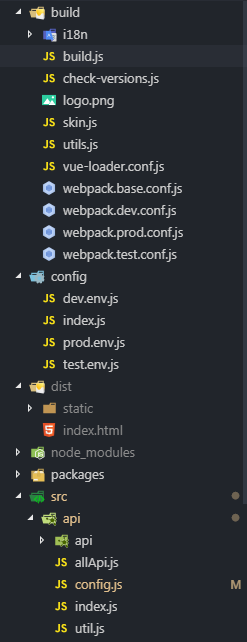

- Indenticator ： 高亮当前代码层级

- Bracket Pair Colorizer ： 括号匹配颜色提示

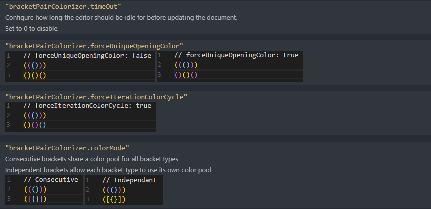

- Color Info ：CSS 颜色显示

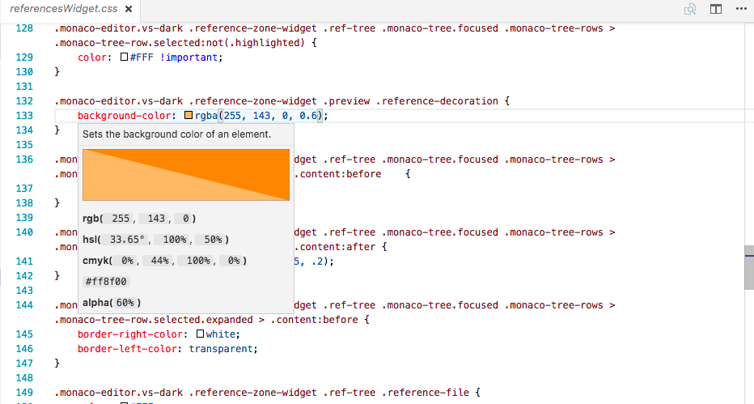

- Comment V ：添加 JS 注释（个性版）

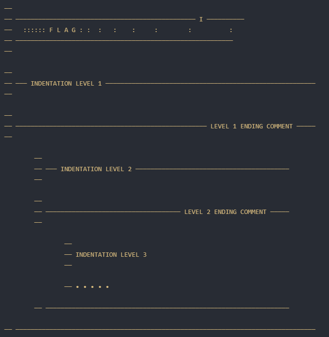

- Background ：编辑区域背景萌萌哒

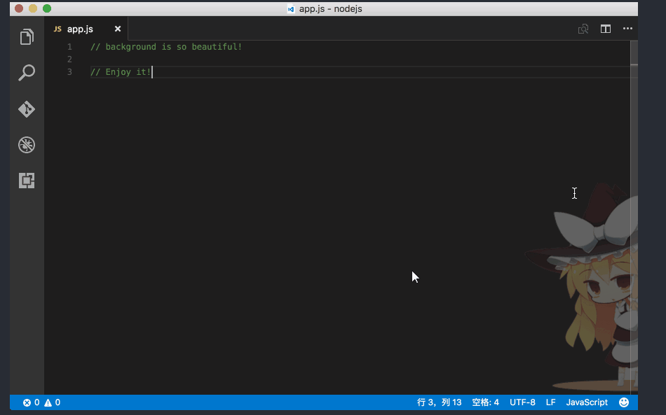

- File peek ： 直接在 javascript、typescript 中查看选中区域的缩略图，并可以直接跳转

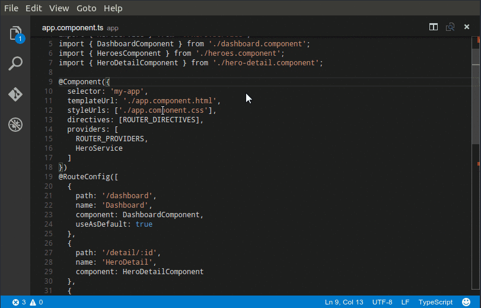

- Log File Highlighter ：控制台输出信息美化

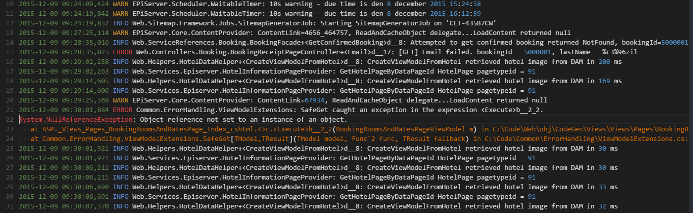

- Markdown Preview Enhanced ：markdown 直接显示

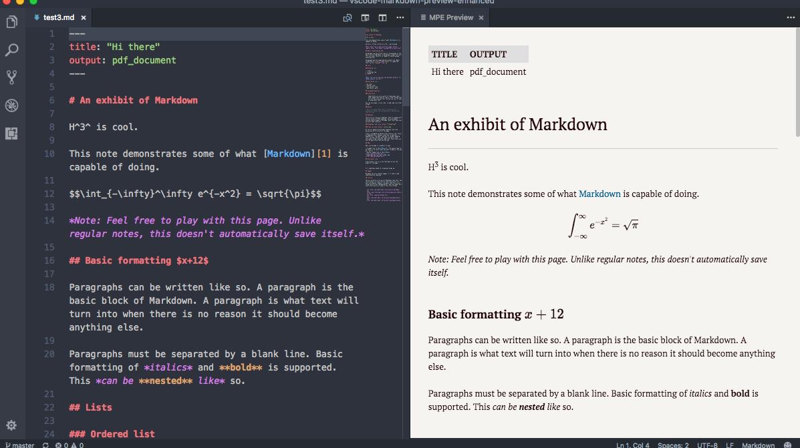

- Node.js Modules Intellisense ：自动补充 node modules 输入路径

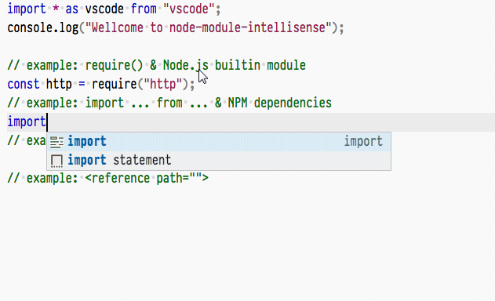

## 手动应用

- Change Case ：快速改变代码类型（字符串、驼峰、变量）

1、Ctrl + Shift + P

2、输入：camel、constant、lower、lowerFirst、snake、upper、upperFirst

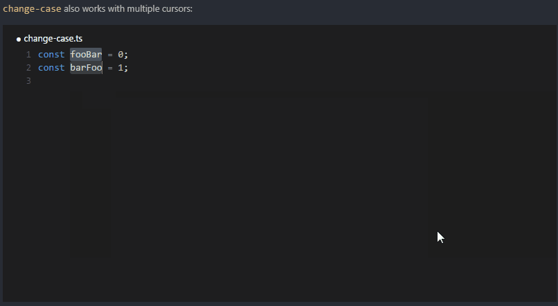

- Code Runner：直接运行代码，C、java、js、python...

1、保存文件，Ctrl+Alt+N 直接运行

2、 Ctrl+Alt+J 更换文件类型，再运行

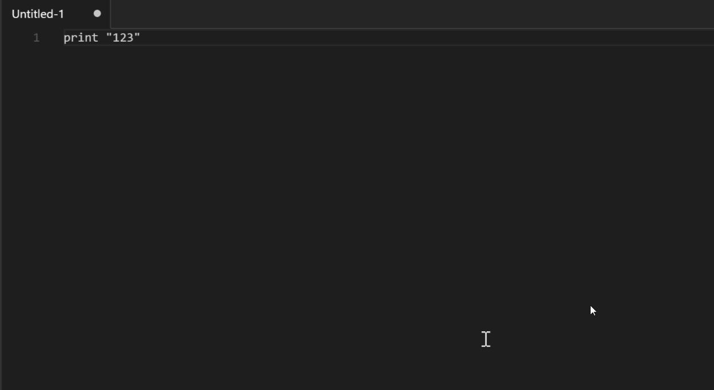

- CodeBing：直接在编辑器中打开浏览器搜索关键词

1、Ctrl + Shift + P

2、输入 Bing

3、输入关键词

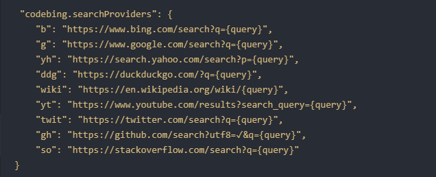

- File Utils：快捷创建、复制、重命名、移动文件或者目录。当前路径或任意路径

1、Ctrl + Shift + P

2、输入 new file

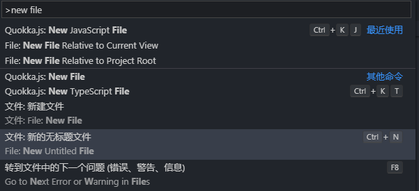

- Npm Intellisense ：自动补充 node modules 输入路径

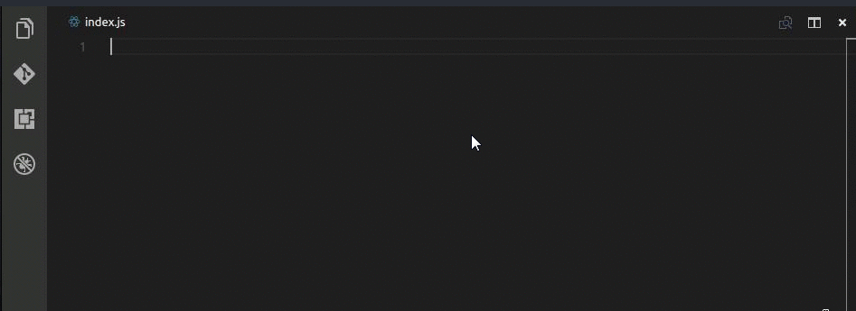

1、Ctrl + Shift + P

2、输入 import

3、输入对应的包，创建同名变量

- Search node_modules ：快速打开 node modules 文件

1、Ctrl + Shift + P

2、输入 search

3、输入对应的包，自动显示文件夹内容，回车打开

