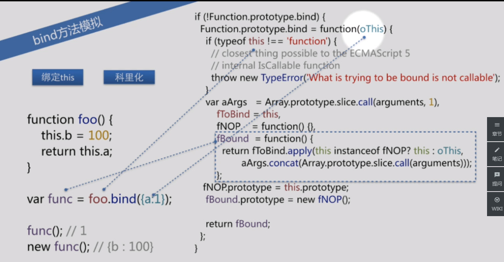
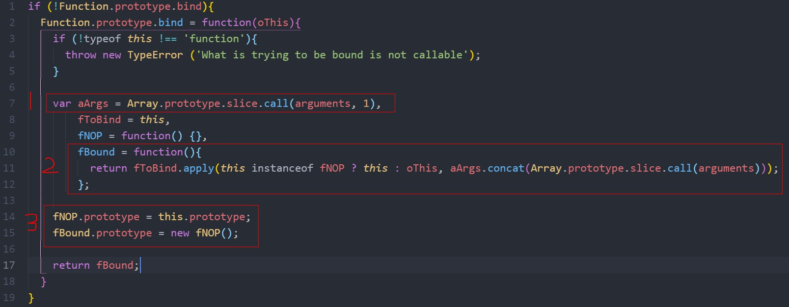

###  bind的polyfill

#### 前言

最近在看文章的时候多次看到改变上下文环境中使用了bind方法，突然想写一下其polyfill方法，结果憋不出来，虽说没有什么实际意义，但后来学习后也算是对基础知识又一次的加固。

call、apply、bind的用法这里就不用多说了，简单说下bind与其他的区别: 

* bind返回函数， 而call、apply 返回函数并执行

* bind涉及到函数科里化，实参可以少于形参； 而call、apply实参必须大于等于形参


#### 实现

```javascript
if (!Function.prototype.bind){
  Function.prototype.bind = function(oThis){
    if (!typeof this !== 'function'){
      throw new TypeError ('What is trying to be bound is not callable');
    }

    var aArgs = Array.prototype.slice.call(arguments, 1),
        fToBind = this,
        fNOP = function() {},
        fBound = function(){
          return fToBind.apply(this instanceof fNOP ? this : oThis, aArgs.concat(Array.prototype.slice.call(arguments)));
        };
      
    fNOP.prototype = this.prototype;
    fBound.prototype = new fNOP();

    return fBound;
  }

  function foo(){
    this.b = 100;
    return this.a
  }


  var func = foo.bind({a:1})

  func(); // this.a = 1
}
```

<div align=center>



</div>

上图已经比较清楚的显示了参数的对应关系，接下来分析代码。整个代码分为3块需要理解的地方，如下图所示

<div align=center>



</div>

* line7：拿到bind函数中传入的参数数组

通过 **Array.prototype.slice.call(arguments, 1)** 因为函数调用时自带的arguments属性并不是一个数组，只是一个类数组，不具有slice这些方法，所以用call方法给slice()指定this为arguments，让arguments也可以实现slice()方法。

slice()方法传入参数1，是slice(start, end)中的一个参数start，表示从arguments的索引为1，即第二个参数开始截取。 
arguments参数只有在函数调用执行的时候才存在，也就是当 **var func = foo.bind({a:1})** 的时候，调用了bind，此时aArgs = []。如果是 **var func = foo.bind({a:1}, 2)** ，那么aArgs = [2]


* line 10：替换上下文，并调用传入的参数

首先，**fToBind.apply(a,b)** 说明上下文环境是a, 参入的参数是b。


**this instanceof fNOP ? this : oThis** 这里的this是func所在的上下文环境，也就是window对象，因为不是函数的实例，所以a也就是apply的上下文环境为oThis,也就是{a:1}

**aArgs.concat(Array.prototype.slice.call(arguments))** aArgs是bind()方法中除上下文环境外传入的参数，这里的**arguments**是调用此func时的arguments，也就是func()的执行环境，和上面的arguments（bind）不一样，在此例中，此时的arguments是空数组，因为并没有给func()传参数。这段contact的意思就是把bind()中传的参数和func()中传的参数连起来，来实现上面提到的bind的科里化。


* line14：继承原型

```javascript
  function foo(x){
    console.log(this); // {a:1, b:130}
    this.b = 100 + x;
    console.log(this.b) // 130
  }

  var func = foo.Mybind({a:1}) 
  func(30)
```

第三步也等价于**fBound.prototype = Object.create(this.prototype)**，这样实例p就能获得foo默认的属性。 

简单版：

```javascript
Function.prototype.bind = Function.prototype.bind || function() {
    var func = this;
    var args = [].slice.call(arguments); // bind中的参数
    var ctx = args.shift(); // 拿到上下文
    return function() {
        func.apply(ctx, args.concat([].slice.call(arguments)));
    }
};
```


