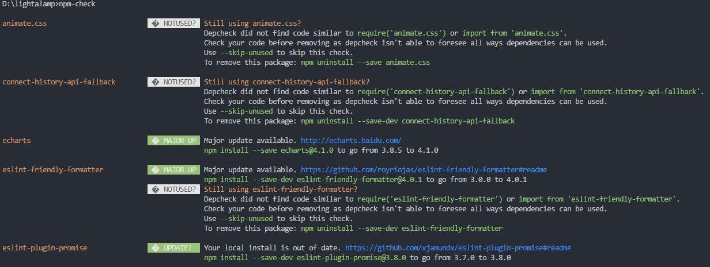
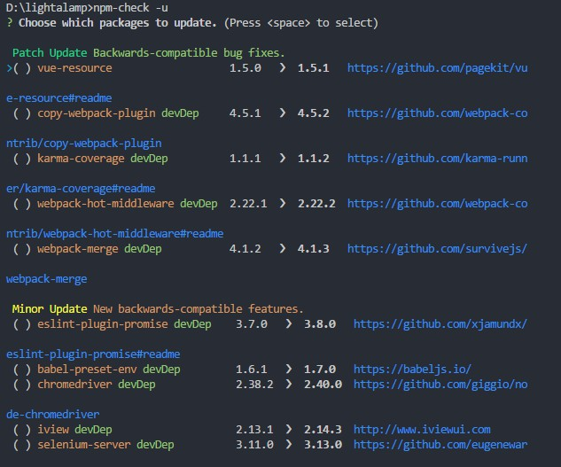
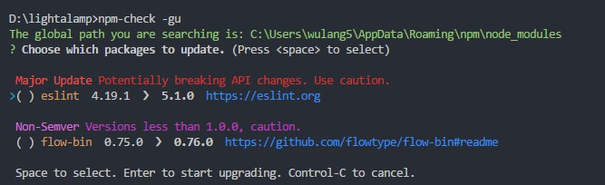

# npm 看我代表月亮简化你

*每日一话：那些情话是我抄来的，想说给你听是真的*

本文介绍了常用的npm命令，插件主要是针对package.json的安装、卸载、更新等操作

## 常用npm操作命令

大多数还是为了看看全局包 o(╯□╰)o

* 1、npm list：查看安装的包及其依赖

* 2、npm uninstall module： 卸载某个模块

* 3、npm uninstall -g module： 卸载全局模块

* 3、npm list -g --depth ： 查看已经全局安装过的包及其依赖项

* 4、npm list -g --depth=0 ： 查看已经全局安装过的包（不包含依赖项）

* 5、npm oudated: 会列出所有已经过时的包

## npm-check

包管理插件 [npm-check](https://www.npmjs.com/package/npm-check) 用来检查那些**需要更新、无用的、不正确包**的一种工具

特点：
* 显示需要更新的包
* 提供包的文档的链接，以便你可以决定是否需要更新。
* 会通知你的代码中是否有使用依赖关系
* 使用-g命令 ，全局搜索所安装的包
* 交互式更新，-u命令
* ...

### 使用背景

通过构建工具构建的项目，其中都会有一个package.json文件，这个文件就是记录用的都有哪些包及其对应的版本。如果想要更新这些包，单独去查询版本然后手动npm install显然费时费力，可以用npm-check来进行更新操作。

### 使用过程

#### npm-check 查看包状态

图中显示了package.json文件中未使用、已使用可以更新的包，还包括描述和路径

npm-check -g 查看全局包状态

#### npm-check -u 更新包

`` 1.5.0 > 1.5.1 `` 第一个版本号就是现在所安装的版本号，第二个就是最新的版本，后面那个链接就是各个包最新版本的文档连接。通过空格键进行确认后，回车进行安装最新版本

#### npm-check -gu 更新全局包

主要显示全局安装过的包文件，可以选择性的进行更新。注意红色提示表明，更新后有可能会造成API的变化，谨慎处理哦。

### 题外话

该插件还提供了每个模块对应的github地址，比起打开浏览器、点开github、输入模块名，这会节约一丢丢时间。

只有一丢丢哦~